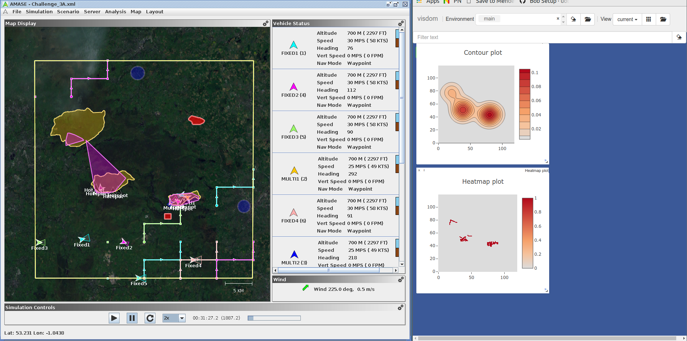

#Description
This is a client for constructing and visualising the predicted areas with fire during the Fire-hack 2019 competition.

The visualisation is managed by Visdom in the browser

## Integration Instructions

* Install Conda
## Running Things
In the terminal do

`conda env create -f environment.yml`

`conda activate bham_brigade_py`

`visdom &`

`pyton MapClient.py`